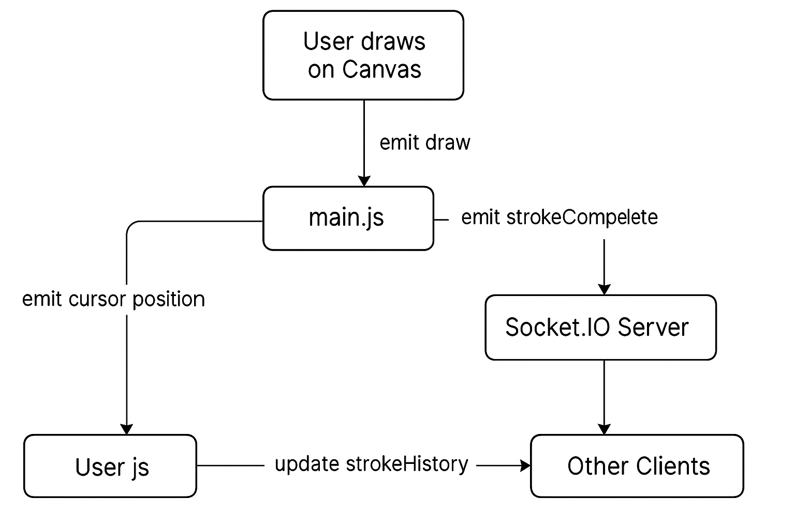

Architecture — Real-Time Collaborative Drawing Canvas

a) Overview

The Collaborative Canvas enables multiple users to draw together on the same canvas in real time using Socket.IO.
Each stroke, cursor movement, and action (undo, clear) is synchronized instantly between all connected clients.

b) Components
Frontend (Client)

Built with HTML5 Canvas + Vanilla JS

Captures mouse/touch events

Sends drawing data (draw, strokeComplete, cursor) to the backend

Listens for updates from other users to re-render the canvas

Manages undo/redo and cursor indicators locally

Backend (Server)

Uses Node.js + Express + Socket.IO

Manages all active user connections

Assigns each user a random color

Relays drawing data between clients

Maintains a global stroke history (strokeHistory)

Handles undo and clear operations for all users

c) Data Flow Diagram

d) WebSocket Event Protocol

Event	          Direction                         	Description

draw	          Client → Server → Others	            Sends real-time brush movement

strokeComplete	  Client → Server → Others	            Sends a completed stroke

cursor	          Client → Server → Others	            Sends current mouse position

undo	          Client → Server → All	                Removes the last global stroke

clearCanvas	      Client → Server → All	                Clears all strokes

assignColor	      Server → Client	                    Assigns unique color to each user

userJoined	      Server → All	                        Broadcasts when a new user connects

userLeft	      Server → All	                        Broadcasts when a user disconnects

e) Global Undo/Redo Strategy

The server maintains a global strokeHistory array that stores all completed strokes.

When a user performs Undo, the server removes the last stroke and notifies all clients using io.emit("undo").

Each client then re-renders the entire canvas using the updated stroke list → ensuring full sync consistency.

This ensures no user desynchronization, even under latency or overlap.

f) Conflict Resolution

1. Simultaneous Drawing

Each stroke is independent and timestamped on creation.

Overlapping strokes are simply rendered sequentially, maintaining smooth visual blending.

2. Undo from Another User

Since undo is global, the server ensures the same canvas state across all users by syncing strokeHistory.

3. Clear Action

When one user clears the canvas, all connected clients receive a clearCanvas event and reset simultaneously.

g) User Management

On connection, the server assigns a unique color randomly from a predefined set.

Each client’s cursor is rendered using that color.

Disconnections trigger a userLeft event, which removes their cursor from all other clients.

h) Performance Optimizations

Sends only delta points during drawing (not entire images) → very lightweight WebSocket traffic.

Canvas re-render happens only when needed (undo, clear) to save processing time.

Minimal DOM manipulation: cursors handled via absolutely positioned divs.

In-memory architecture (no DB) → ultra-fast response, low latency.

i) Tech Stack Summary

Layer -	    Technology

Frontend -	HTML5, CSS3, Vanilla JS

Backend -	    Node.js, Express, Socket.IO

Hosting	-    Render (Node Web Service)

Protocol -	WebSockets (bi-directional)

j) Deployment Configuration

Setting -	         Value

Platform -	     Render.com

Environment -	     Node

Build Command -	 npm install

Start Command -	 npm start

Port -	        `process.env.PORT

Branch -	         main

k) Summary

Real-time synchronization for multiple users

Server-managed global state for consistency

Lightweight, framework-free implementation

Perfect for demonstrating WebSocket event architecture

l) Future Enhancements

Persistent storage (Redis or MongoDB)

Per-user Undo/Redo

Touch/mobile support

Shape tools (rectangles, circles)

Multiple rooms/sessions
